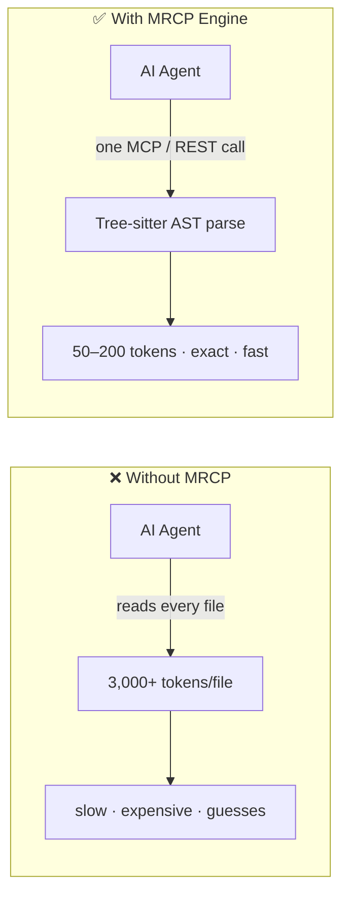

<div align="center">

# 🧠 MRCP Engine

### The Machine-Readable Context Protocol for AI Agents

**Stop feeding your AI agent raw source code. Give it structured intelligence instead.**

[🇧🇷 Ler em Português](README.pt-BR.md) · [🇬🇧 English](README.md)

[](https://www.npmjs.com/package/mrcp-engine)
[](https://www.npmjs.com/package/mrcp-engine)
[](LICENSE)
[](CONTRIBUTING.md)
[](https://modelcontextprotocol.io)

[Quick Start](#-quick-start-30-seconds) · [Why MRCP](#-why-mrcp-engine) · [Tools](#-tool-catalog) · [Live Demo](#-live-instance) · [Contributing](CONTRIBUTING.md)

</div>

---

## The problem

Every time an AI coding agent reads your repository by opening file after file, it's paying what this project calls the **"AI Tax"**: thousands of wasted tokens, slower responses, and a real chance of hallucinating about code it half-read.

**MRCP Engine** is a deterministic, AST-based intelligence layer that sits between your repository and your AI agent. Instead of dumping raw files into the context window, it parses your code once with **Tree-sitter WebAssembly** and hands back exactly the structured JSON your agent asked for — architecture graphs, security audits, type signatures, dead code, docs, and more.



No LLM calls, no guessing — just deterministic parsing that turns an entire repository into a context package your agent can actually afford to read.

---

## ⚡ Quick Start (30 seconds)

Auto-configure every MCP-compatible IDE and AI agent installed on your machine with a single command:

```bash
npx mrcp-engine setup
```

This detects and wires up the MCP server for:

| | | | |
|---|---|---|---|
| 🟢 Claude Desktop | 🟢 Claude Code | 🟢 Cursor | 🟢 Windsurf |
| 🟢 VS Code | 🟢 Antigravity IDE | 🟢 Gemini CLI | 🟢 OpenCode |
| 🟢 Ollama (MCP) | 🟢 Codex | | |

Prefer to wire it up by hand? Add this to your MCP client config:

```json
{
  "mcpServers": {
    "mrcp-engine": {
      "command": "npx",
      "args": ["-y", "mrcp-engine@latest"]
    }
  }
}
```

Or point any remote-HTTP-capable client (Antigravity, Cursor, Windsurf, VS Code) straight at the hosted instance — no install required:

```json
{
  "mcpServers": {
    "mrcp-engine": {
      "url": "https://mrcp-engine.vercel.app/api/mcp",
      "transport": "streamable-http"
    }
  }
}
```

No MCP support in your client? Every tool is also a plain `GET`/`POST` REST endpoint — see [REST API reference](#-rest-api-reference).

---

## 🤔 Why MRCP Engine?

| | Raw context stuffing | MRCP Engine |
|---|---|---|
| **How it reads code** | LLM re-reads full file text | Deterministic Tree-sitter AST parse |
| **Token cost** | ~3,000 tokens per average file | ~50–200 tokens per structured response |
| **Consistency** | Varies by prompt, can hallucinate structure | Same JSON schema, every time |
| **Coverage** | One file at a time | Whole-repo graph in one call |
| **Non-code assets** | Usually skipped | CSV/DOCX/XLSX/PDF/JSON/YAML/XML via `mrcp_document_analyzer` |
| **Security/architecture checks** | Manual prompting | Purpose-built audit tools |

MRCP doesn't replace your LLM's reasoning — it replaces the *expensive, unreliable part* of getting code into that reasoning in the first place.

---

## 🎯 Two Ways to Consume It

1. **⚡ Modular mode** — call exactly the tool you need (`mrcp_document_analyzer`, `mrcp_security_compliance_audit`, `mrcp_code_metrics_health_scorer`...) for a focused, single-purpose task.
2. **🚀 Full Suite mode** — one call (`mrcp_run_full_repository_suite` / `GET /api/full-analysis`) runs all 13 analysis tools in parallel, streams intermediate results to `mrcp-analysis.json`, and returns a consolidated executive report.

---

## 🛠 Tool Catalog

<details>
<summary><b>1. 🏗️ Core Engine & Document Intelligence</b> — click to expand</summary>

| Tool | Endpoint | What it does |
|---|---|---|
| `analyze_repository` | `GET /api/analyze?repo=<url>` | Structural AST graph: nodes (files/modules/functions), edges (dependencies), cyclomatic complexity, coupling, hotspots |
| `mrcp_document_analyzer` | `GET /api/document-analyzer?repo=<url>` | Deterministic parser for **non-code** repos: CSV, TSV, TXT, MD, DOCX, XLSX, XLS, PDF (text layer), JSON, YAML, XML, LOG. Produces a knowledge graph, tabular schema inference with TypeScript interfaces, a Document Quality Index (0–100), and broken-link detection — no OCR |
| `get_repository_skills_contract` | `GET /api/skills?repo=<url>` | Refactoring contracts for hotspot files (complexity > 50), enforcing a Zero Regression Policy on public signatures |
| `mrcp_run_full_repository_suite` | `GET /api/full-suite?repo=<url>` | Runs all 13 tools in parallel and writes the executive dashboard |

</details>

<details>
<summary><b>2. ⚡ High-Efficiency Agent Offloading</b> — click to expand</summary>

| Tool | Endpoint | What it does |
|---|---|---|
| `mrcp_api_contract_generator` | `GET /api/api-contract?repo=<url>` | Extracts routes/handlers (Next.js, Express, Fastify, Hono, FastAPI, Flask) → OpenAPI 3.0.3 spec + typed TypeScript SDK, hallucination-free |
| `mrcp_monorepo_package_graph_analyzer` | `GET /api/monorepo-graph?repo=<url>` | Maps pnpm/turborepo/lerna/nx topology, inter-package deps, topological build order, packages affected by a diff |
| `mrcp_docstring_api_doc_generator` | `GET /api/doc-generator?repo=<url>` | Generates TSDoc/JSDoc/Python docstrings and Markdown API reference tables for undocumented public symbols |
| `mrcp_ast_refactor_applier` | `POST /api/refactor-applier` | Batch AST refactors — rename symbols, extract interfaces, update imports across dozens of files — in ~30ms |
| `mrcp_type_signature_extractor` | `GET /api/type-signature-extractor?repo=<url>` | Extracts **only** type signatures / `.d.ts` / Zod schemas, stripping function bodies (≈3,000 → 50 tokens) |
| `mrcp_git_diff_semantic_summarizer` | `POST /api/diff-summarizer` | Strips formatting noise from diffs, summarizes changes by semantic domain at the AST level |
| `mrcp_dependency_compatibility_resolver` | `GET /api/dependency-resolver?package=<name>` | Resolves SemVer compatibility, peer-dependency conflicts, and breaking-change risk against the real npm registry |
| `mrcp_dead_code_pruner` | `GET /api/dead-code-pruner?repo=<url>` | AST reachability analysis for unused exports, dead variables, unused imports |
| `mrcp_sql_schema_orm_contract_generator` | `GET /api/sql-orm-contract?repo=<url>` | Parses Prisma / SQL DDL / Drizzle / TypeORM into typed tables and queries |

</details>

<details>
<summary><b>3. 🛡️ Predictive & Security Engineering</b> — click to expand</summary>

| Tool | Endpoint | What it does |
|---|---|---|
| `mrcp_code_metrics_health_scorer` | `GET /api/code-health?repo=<url>` | Maintainability Index (0–100), technical-debt grade (A–F), cognitive-load distribution, top 5 refactor priorities with effort estimates |
| `mrcp_env_secret_contract_validator` | `GET /api/env-validator?repo=<url>` | Maps `process.env` / `os.environ` usage, audits against `.env.example`, flags leak risk in public bundles, generates Zod validation schemas |
| `mrcp_impact_analysis` | `POST /api/impact-analysis` | AST **Blast Radius** — downstream files/tests impacted by a change, before you commit |
| `mrcp_security_compliance_audit` | `GET /api/security-audit?repo=<url>` | Static AST security audit: OWASP patterns, hardcoded secrets, unsafe shell execution, vulnerable deps, GPL license exposure |
| `mrcp_architectural_drift_detector` | `GET /api/architecture-drift?repo=<url>` | Detects architectural drift, circular dependencies (Tarjan's algorithm), Clean Architecture violations |
| `mrcp_auto_test_coverage_gap_finder` | `GET /api/test-gap-analysis?repo=<url>` | Maps high-complexity, untested functions and generates Vitest/Jest stubs |
| `mrcp_context_pruning_pack` | `GET /api/context-pack?repo=<url>&task=<desc>` | Task-aware AST context slicing — 60–90% token savings |

</details>

<details>
<summary><b>4. 🌐 Web Search & Scraping</b> — click to expand</summary>

| Tool | Endpoint | What it does |
|---|---|---|
| `mrcp_web_search` | `GET /api/web-search?q=<query>` | Fast web search |
| `mrcp_web_scrape` | `GET /api/scrape?url=<url>` | Clean text extraction, stripped of ads/nav/scripts |
| `mrcp_web_smart_search` | `GET /api/smart-search?q=<query>&topN=2` | Search + ranked scrape of the top N results |

</details>

<details>
<summary><b>5. 👥 Triage & HR</b> — click to expand</summary>

| Tool | What it does |
|---|---|
| `mrcp_triage_parse_resume` | Deterministic résumé parsing |
| `mrcp_triage_score_candidate` | Job-description-vs-candidate match score |
| `mrcp_triage_generate_hr_report` | Formatted technical opinion for HR |

</details>

---

## 🌐 REST API Reference

Every MCP tool is also a plain HTTP endpoint — use it from any language, no MCP client required:

```bash
curl "https://mrcp-engine.vercel.app/api/analyze?repo=https://github.com/your-org/your-repo"
```

<details>
<summary>Full endpoint table</summary>

| Endpoint | Method | Description |
|---|---|---|
| `/api/analyze?repo=<url>` | `GET` | AST graph & complexity metrics |
| `/api/skills?repo=<url>` | `GET` | Refactoring contracts for hotspots |
| `/api/api-contract?repo=<url>` | `GET` | Route extraction, OpenAPI 3.0, TypeScript SDK |
| `/api/code-health?repo=<url>` | `GET` | Maintainability Index & technical debt |
| `/api/env-validator?repo=<url>` | `GET` | `.env` validation, leak alerts, Zod schema |
| `/api/monorepo-graph?repo=<url>` | `GET` | Package dependency graph & build order |
| `/api/doc-generator?repo=<url>` | `GET` | JSDoc/TSDoc generator & API reference |
| `/api/refactor-applier` | `POST` | Batch AST refactors |
| `/api/type-signature-extractor?repo=<url>` | `GET` | Type-signature-only extraction |
| `/api/diff-summarizer` | `POST` | Semantic git-diff summary |
| `/api/dependency-resolver?package=<name>` | `GET` | Version/compatibility resolution |
| `/api/dead-code-pruner?repo=<url>` | `GET` | Dead-code detection |
| `/api/sql-orm-contract?repo=<url>` | `GET` | Typed DB/ORM contracts |
| `/api/impact-analysis` | `POST` | Change blast radius (`body: { repoUrl, modifiedFiles }`) |
| `/api/security-audit?repo=<url>` | `GET` | Security & license audit |
| `/api/architecture-drift?repo=<url>` | `GET` | Architecture drift detection |
| `/api/test-gap-analysis?repo=<url>` | `GET` | Test-gap detection & stubs |
| `/api/context-pack?repo=<url>&task=<desc>` | `GET` | Task-sliced LLM context package |
| `/api/full-analysis` | `GET` | Full 13-tool diagnostic suite |
| `/api/mcp` | `POST` | Central MCP endpoint (JSON-RPC 2.0) |

</details>

---

## 🧩 IDE Extension (VS Code · Cursor · Windsurf)

`apps/vscode` ships a native extension bringing MRCP's analysis straight into your editor:

- **Sidebar** — Quick Actions, Health Metrics (A–F / MI 0–100), Security & `.env` Audit, Architecture & Dependencies, Test Gaps & Dead Code, Document Intelligence (DQI)
- **MRCP Cockpit** — visual dashboard: complexity distribution, live KPIs, AST graph viewer, jump-to-code security/route tables
- **Inline CodeLens** — real-time cyclomatic complexity (`⚡ MRCP: Complexity 3 (Low 🟢)`) plus a one-click **Copy for AI** button on every function/class/method
- **Problems panel integration** — native warnings for exposed secrets and missing `.env` variables
- **AI Context Packer** — one-click, ~95%-token-savings context packaging to paste into ChatGPT, Claude, or Cursor

```bash
pnpm --filter mrcp-vscode compile
cd apps/vscode && npm run package   # → mrcp-vscode-2.6.0.vsix
```

---

## 📡 Live Instance

A hosted instance is already running — no setup needed to try it:

**`https://mrcp-engine.vercel.app`**

```bash
curl "https://mrcp-engine.vercel.app/api/code-health?repo=https://github.com/facebook/react"
```

---

## 🗺 Roadmap

- [x] 13-tool full diagnostic suite with parallel execution
- [x] Native VS Code / Cursor / Windsurf extension
- [x] Document intelligence for non-code repositories
- [ ] **v3**: on-demand file-content retrieval — request a specific file by the metadata MRCP already returned, and get its content back as structured JSON (including visual content where applicable)
- [ ] Expanded language grammars beyond the current 14+

Have a request? [Open a feature issue](../../issues/new?template=feature_request.md).

---

## 🤝 Contributing

Issues, feature requests, and PRs are welcome — see [CONTRIBUTING.md](CONTRIBUTING.md) for setup and guidelines, and [CODE_OF_CONDUCT.md](CODE_OF_CONDUCT.md) for community expectations.

If MRCP Engine saves your agent (or your wallet) some tokens, a ⭐ star genuinely helps other people find it.

## 📄 License

[MIT](LICENSE) © faelscarpato

---

<div align="center">

### ⭐ Star History

[](https://star-history.com/#faelscarpato/mrcp-engine&Date)

</div>
